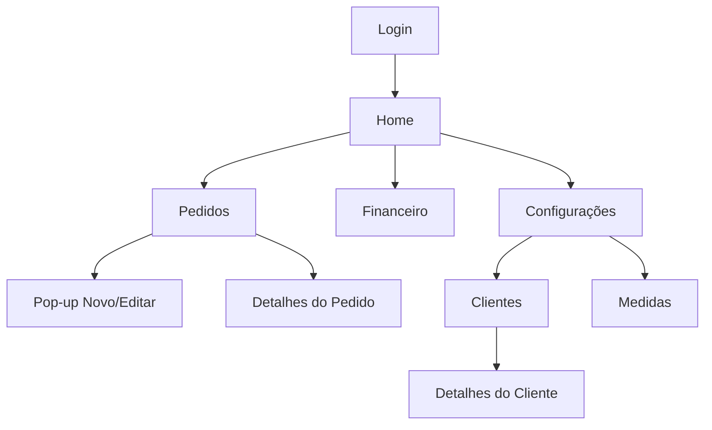

<div align="center">
  <h1>💎 PROJETO: <span style="color:#6A1B9A">COSTURA CERTA</span></h1>
  <p>
    <em>Gestão simples, bonita e 100% offline para ateliês e costureiras</em>
  </p>
  <p>
    
    
    
  </p>
  <p>
    <a href="#o-que-h%C3%A1-no-projeto-atual"><b>Funcionalidades</b></a> ·
    <a href="#arquitetura-e-rotas"><b>Arquitetura</b></a> ·
    <a href="#como-executar"><b>Como executar</b></a> ·
    <a href="#roadmap-pr%C3%B3ximas-entregas"><b>Roadmap</b></a>
  </p>
</div>

<details>
  <summary><b>🚀 Visão Geral</b></summary>
  <p>
    Um sistema local e inteligente de gestão para costureiras, autônomos e pequenos empreendedores.
    Focado em simplicidade, cálculos automáticos e organização financeira <b>sem internet</b>.
  </p>
  <ul>
    <li>Registrar pedidos de clientes.</li>
    <li>Calcular custos, lucros e totais automaticamente.</li>
    <li>Controlar entradas, gastos e lucro líquido.</li>
    <li>Acompanhar o desempenho financeiro do ateliê.</li>
  </ul>
</details>

<details>
  <summary><b>🎨 Tema</b></summary>
  <ul>
    <li>Apenas modo claro.</li>
    <li>Cores suaves e elegantes (bege claro, lilás e dourado).</li>
    <li>Visual limpo, organizado e responsivo.</li>
  </ul>
</details>

---

## O que há no projeto (atual)

<table>
  <tr>
    <td><b>🔐 Autenticação local</b><br/><sub>Hive com nome, PIN (opcional) e lembrar acesso.</sub></td>
    <td><b>🧭 Navegação inferior</b><br/><sub>Abas: Pedidos, Financeiro e Configurações.</sub></td>
  </tr>
  <tr>
    <td><b>🧵 Pedidos</b><br/><sub>Status, “Pago/Não pago” colorido, pop-up de novo/editar com cálculo e toggle Pago, pergunta ao concluir, filtros por status/pagos.</sub></td>
    <td><b>📄 Detalhes do Pedido</b><br/><sub>Editar (toggle Pago), concluir com pergunta e AppBar com seta preta.</sub></td>
  </tr>
  <tr>
    <td><b>💰 Financeiro</b><br/><sub>Cards responsivos (Receita, Gastos, Lucro) e pedidos recentes sem overflow.</sub></td>
    <td><b>⚙️ Configurações</b><br/><sub>Perfil (editar Nome/Ateliê e PIN mascarado), Excluir conta com PIN, atalhos para Clientes e Medidas, Backup (placeholder).</sub></td>
  </tr>
  <tr>
    <td><b>👥 Clientes</b><br/><sub>Agrupa por cliente com cores de inadimplência (0=verde, 1=amarelo, ≥2=vermelho) e tela de detalhes.</sub></td>
    <td><b>📏 Medidas</b><br/><sub>Cadastro simples de medidas/observações por cliente (Hive `medidas_box_v1`).</sub></td>
  </tr>
</table>

## Arquitetura e rotas

- **Camadas**
  - `models/` — modelos como `pedido.dart`, `insumo.dart`.
  - `services/` — `auth_service.dart`, `database_service.dart`, `pedidos_provider.dart`, `calculadora_preco_service.dart`, `medidas_service.dart`.
  - `screens/` — `login_screen.dart`, `home_screen.dart`, `pedidos_screen.dart`, `detalhes_pedido_screen.dart`, `financeiro_screen.dart`, `config_screen.dart`, `clientes_screen.dart`, `cliente_detalhes_screen.dart`, `medidas_screen.dart`.
  - `theme/` — `app_theme.dart` (tema claro e paleta centralizada).
  - `widgets/` — componentes (`custom_card.dart`, `custom_button.dart`, etc.).

- **Rotas** definidas em `lib/routes.dart`:
  - `'/login'`, `'/pedidos'`, `'/detalhes'`, `'/financeiro'`, `'/config'`, `'/calculadora'`, `'/clientes'`, `'/cliente_detalhes'`, `'/medidas'`.

## Tecnologias

- Flutter + Provider + Hive (persistência offline)
- `intl` para formatação PT-BR (a aplicar gradualmente nas telas)

## Cálculos Automáticos

- Mão de obra sugerida: `(valorTecido + gastosExtras) × 0.5`
- Total: `(valorTecido + gastosExtras + maoDeObra) - desconto`
- Lucro: `total - (valorTecido + gastosExtras)`

## Como executar

```bash
flutter pub get
flutter run
```

---

## Roadmap (próximas entregas)

- **Formatos PT-BR**: aplicar `intl` em todas as telas (valores e datas).
- **Pagamentos**: filtros avançados, relatórios de recebimentos por período.
- **Gráficos**: lucro por mês e KPIs visuais.
- **Exportação/Backup**: exportar dados localmente (CSV/JSON) e restauração.
- **Testes**: unidade e widget (principalmente cálculos e providers).

---

<details>
  <summary><b>🗺️ Fluxo de Telas</b></summary>



</details>

> Nota pessoal: este app está sendo desenvolvido primeiramente para ajudar minha mãe, que é costureira, e futuramente auxiliar outras pessoas como ela.

---
Costura Certa — gestão simples e offline para seu ateliê.
- Um App que esta sendo desenvolvido primeiramnete para ajudar minha mãe que é uma costureira e futuramente auxiliar outra pessoas iguais a ela